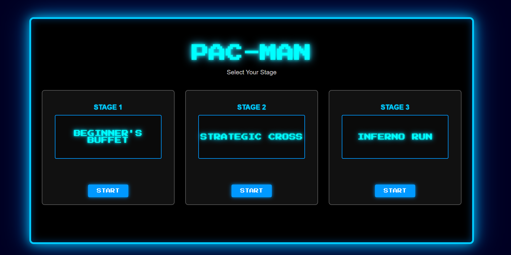
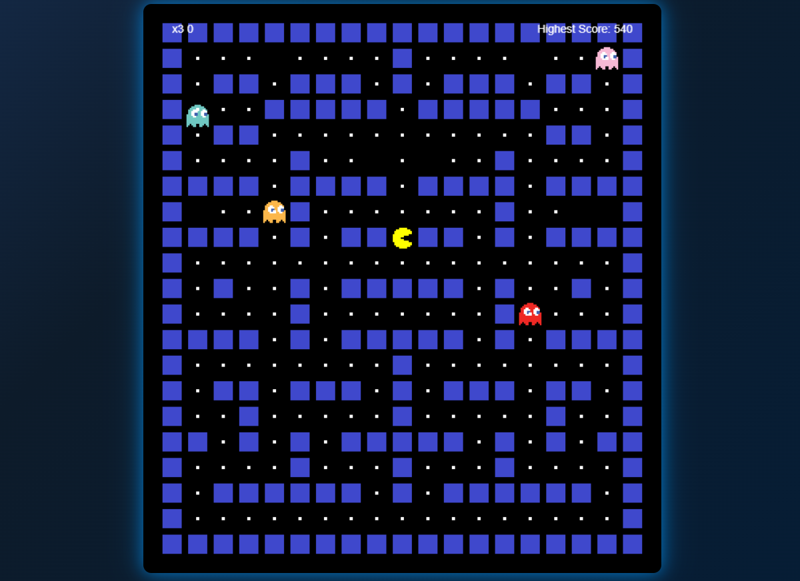

# Pac-Man

A classic Pac-Man game implemented in JavaScript.

## Key Features & Benefits

- Faithful recreation of the original Pac-Man gameplay.
- Multiple levels with increasing difficulty.
- Classic Pac-Man sound effects and visuals.
- Utilizes HTML, CSS, and JavaScript for a web-based experience.

## Project Images

Home Page


Level 

## Prerequisites & Dependencies

Before you begin, ensure you have the following installed:

-   **Web Browser:**  A modern web browser such as Chrome, Firefox, Safari, or Edge.

## Installation & Setup Instructions

1.  **Clone the Repository:**

    ```bash
    git clone https://github.com/theriakhurana/pacman.git
    cd pacman
    ```

2.  **Open `index.html` in your browser:**

    Simply double-click the `index.html` file in the cloned directory to open it in your web browser.

## Usage Examples

1.  **Navigate to the level selection screen:** Open `index.html`.

2.  **Choose a level:** Click on the level you want to play (Level 1, Level 2, or Level 3).

3.  **Play the Game:** Use the arrow keys (Up, Down, Left, Right) Or (W,S,A,D) to control Pac-Man. Avoid the ghosts and eat all the pellets to advance.


## Configuration Options

There are no specific configuration options exposed for end-users in this version.  Future versions might include options for difficulty settings, sound volume, or customizable controls.

## Contributing Guidelines

We welcome contributions to this project! If you'd like to contribute:

1.  Fork the repository.
2.  Create a new branch for your feature or bug fix.
3.  Make your changes and commit them with clear, descriptive messages.
4.  Submit a pull request to the main branch.

## License Information

License not specified. All rights reserved by theriakhurana.

## Acknowledgments

*   Inspired by the original Pac-Man game.
*   Uses resources (images) freely available for non-commercial educational purposes.
